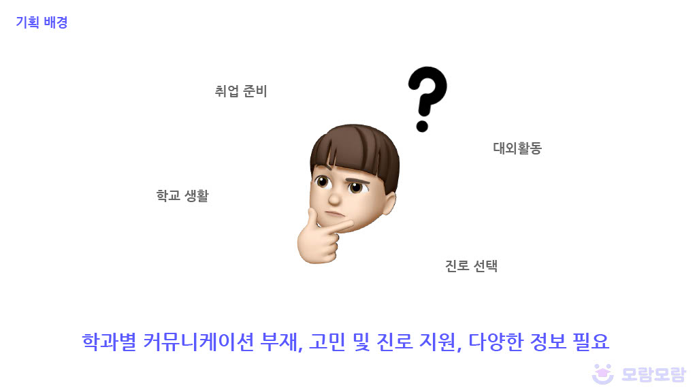
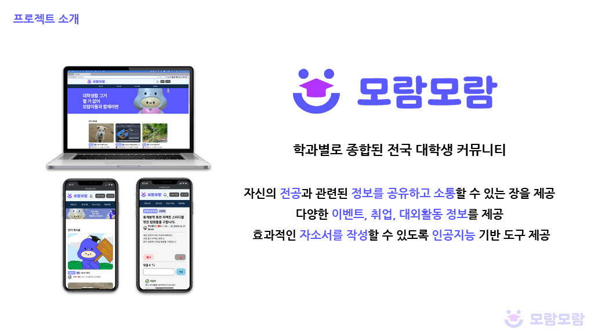
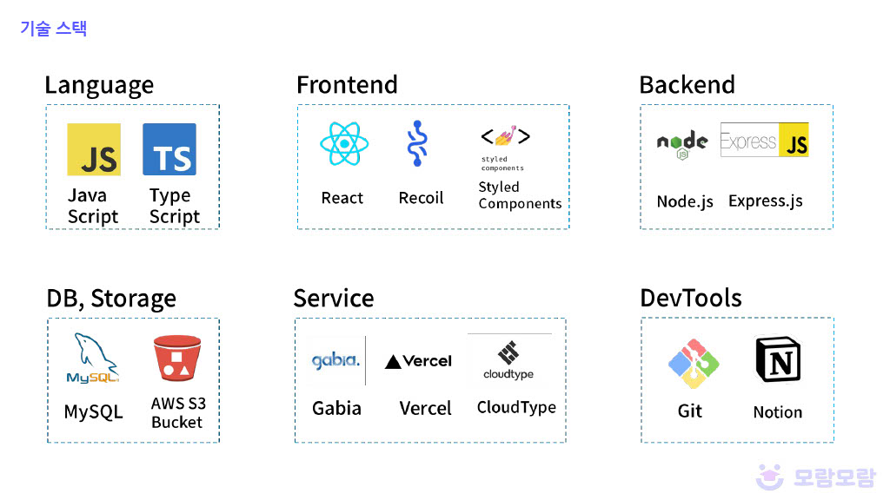
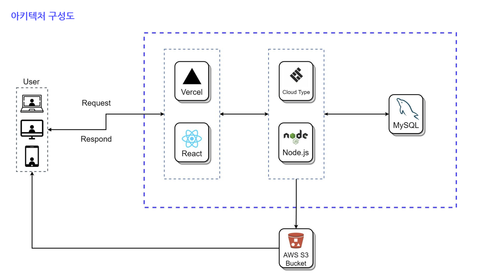
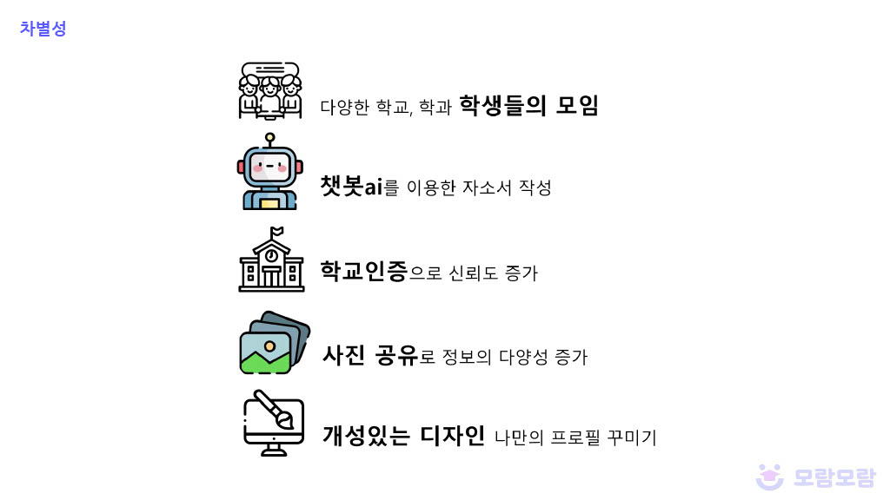
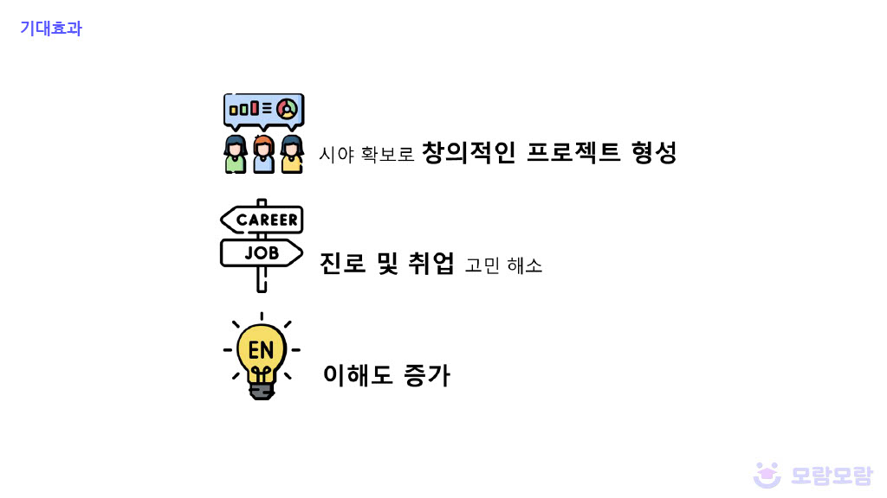

### 👉 서비스 링크: https://www.moram2.com

 

## 개발 기간

### 2023.09.26 ~ 2023.11.19 (8주)

 

## 팀 구성

<table>
  <tr >
    <td align="center" width="200px" >
      
    </td>
        <td align="center" >
      
    </td>
      <td align="center" width="200px" >
      
    </td>
    <td align="center" width="200px" >
      
    </td>
    <td align="center" width="200px" >
      
    </td>
    <td align="center" width="200px" >
      
    </td>
  </tr>
  <tr>
    <td align="center" width="200px" >
      <a href="https://github.com/sanghee01/"><strong>이상희</strong></a> Fronted
    </td>
    <td align="center" width="200px" >
      <a href="https://github.com/dlrhdns75177/"><strong>이고운</strong></a> Frontend
    </td>
    <td align="center" width="200px" >
      <a href="https://github.com/nemokoala/"><strong>박재연</strong></a> FullStack
    </td>
    <td align="center" width="200px" >
      <a href="https://github.com/Isonade2/"><strong>전준영</strong></a> Backend
    </td>
    <td align="center" width="200px" >
      <a href="https://github.com/maybeaj/"><strong>이효진</strong></a> Backend
    </td>
    <td align="center" width="200px" >
      <a href="https://github.com/leeyeonju02/"><strong>이연주</strong></a> Backend
    </td>
    
  </tr>
</table>
 

 

